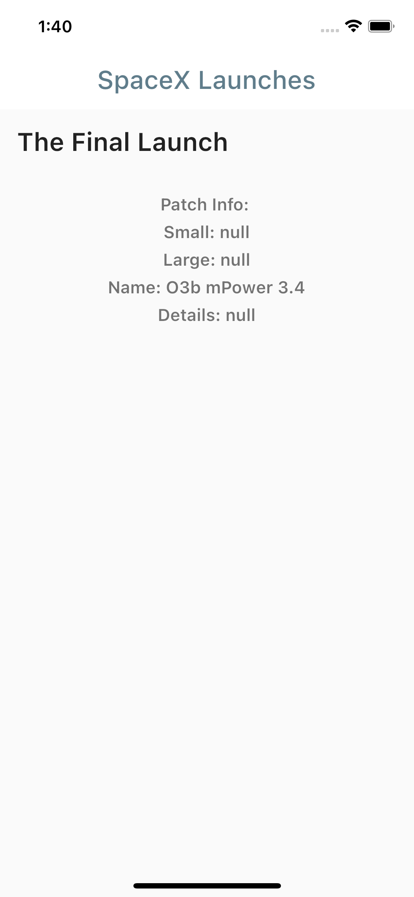

# Story App

SpaceX Launches application developed with Flutter

## Table of contents

- [Overview](#overview)
  - [Screenshot](#screenshot)
  - [Built with](#built-with)
- [Introduction](#introduction)
  - [Screens (UI)](#ui-screens)
  - [Widgets (UI)](#ui-widgets)
  - [Logic](#logic)
  - [Data](#data)
  - [Packages](#packages)
- [Author](#author)

## Overview

### Screenshot

### Built with

Languages:

- Dart
- Flutter

Concepts:

- UI: Slivers, Pull-to-refresh
- Logic: Bloc Design Patter
- Data: SPaceX Launch APIs

## Introduction

An app that displays the latest SpaceX Launch built with bloc.

Features include:

- Getting latest SpaceX launch
- Updating the state with pull-to-refresh

### Screens (UI)

There is a single page:

Home Page: Page that displays the results

### Widgets (UI)

Below you can see the list of widgets.

Custom Progress Indicator: The progress indicator to display the loading state  
FinalLaunch: The widget that displats the result (inside Home Page)

### Logic

BLoc design pattern and state managemenet library used for logic.

Launch Bloc: Launch is accessed and updated through this bloc.

### Data

Data is composed of 3 parts: Models, Providers and Repositories

- Data Models:

Launch Model: Launch model is implemented here

- Data Providers:

Launch Provider: This is the data layer consist of APIs

- Data Repositories:

Launch Repository: Turns API result into Launch object and returns to bloc layer

### Packages

Below you can see the packages used.

http: For API requests  
flutter_bloc: Bloc  
equatable: Bloc Object Equalization  
pull_to_refresh: Pull to fresh feature

## Author

Erke Canbazoğlu

- Linkedin - [Erke Canbazoğlu](https://www.linkedin.com/in/erkecanbazoglu/)
- Github - [erkecanbazoglu](https://github.com/erkecanbazoglu)
